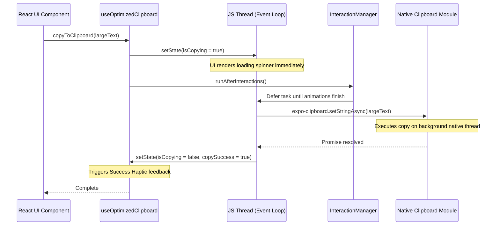

# Clipboard Strategy: Asynchronous Performance Optimization for Large Text

This document outlines the architecture, performance challenges, and implementation strategy for optimizing clipboard operations (copy and paste) in the TeachLink Mobile application, specifically targeting large text payloads (100KB to 2MB+).

---

## 1. The Core Performance Problem

In React Native, clipboard operations interact directly with the host operating system's clipboard service. This introduces several performance bottlenecks:

1. **Bridge Serialization Overhead**: Data must be serialized to JSON, sent across the React Native bridge (IPC channel), and deserialized on the native side. For a 100KB - 2MB string, this serialization and IPC transfer is highly CPU-intensive.
2. **Single-Threaded JS Blockage**: Because the JavaScript engine is single-threaded, if a heavy serialization or string allocation task runs synchronously, it blocks the main JS thread. This prevents React from committing layouts, responding to touch events, or animating frames (resulting in visible UI freezes).
3. **Garbage Collection (GC) Thrashing**: Allocating massive string buffers dynamically in JS memory and immediately discarding them triggers garbage collection runs, causing micro-stutters.

---

## 2. Architectural Solution

To achieve a responsive, smooth copy/paste experience, we implement an **asynchronous deferred execution pipeline** combined with **UX state tracking**.



### Key Optimizations

1. **Native Asynchronous APIs (`expo-clipboard`)**:
   We use the native `setStringAsync` and `getStringAsync` calls from `expo-clipboard`. This delegates the actual clipboard read/write operation to native background worker threads, minimizing main thread blockage.

2. **React Render Pre-emption**:
   Before initiating the bridge call, we update the React loading state (`isCopying = true`). We then wrap the clipboard call in `InteractionManager.runAfterInteractions` combined with a `setTimeout(..., 0)` macro-task. This guarantees that React finishes its render cycle and paints the loading indicator onto the screen *before* the JS thread gets occupied by string serialization.

3. **Telemetry & Profiling**:
   Every clipboard action records start and end timestamps using `performance.now()`. These metrics (duration, size in bytes) are saved into a telemetry object (`ClipboardOperationMetrics`) and logged, enabling performance monitoring and regression detection.

4. **UX Feedback & Physical Confirmation**:
   - **Visual Feedback**: Real-time spinner indicators are displayed on copying and pasting.
   - **Success State**: "Copied!" checkmarks dynamically display on successful copy operations.
   - **Haptic Feedback**: Physical click vibrations (`expo-haptics`) are triggered upon successful copying to reinforce the action without requiring the user to look at the screen.

---

## 3. Usage Guidelines

### The `useOptimizedClipboard` Hook

Always use the custom React hook rather than calling native clipboard APIs directly.

```tsx
import { useOptimizedClipboard } from '@/hooks/useOptimizedClipboard';

function MyComponent() {
  const { 
    isCopying, 
    copySuccess, 
    copyToClipboard, 
    metrics 
  } = useOptimizedClipboard();

  return (
    <Button 
      onPress={() => copyToClipboard("Some large content...")}
      disabled={isCopying}
    >
      {isCopying ? "Copying..." : copySuccess ? "Copied!" : "Copy"}
    </Button>
  );
}
```

### Payload Size Recommendations

- **Safe Range (0 - 500KB)**: Highly responsive; almost instantaneous (under 50ms).
- **Caution Range (500KB - 2MB)**: Operates cleanly. The loading spinner will show briefly due to bridge transfer latency.
- **Extreme Range (2MB+)**: Mobile operating systems have IPC payload limits on native binders. It is recommended to compress or slice payloads exceeding 2MB before writing to the clipboard.
